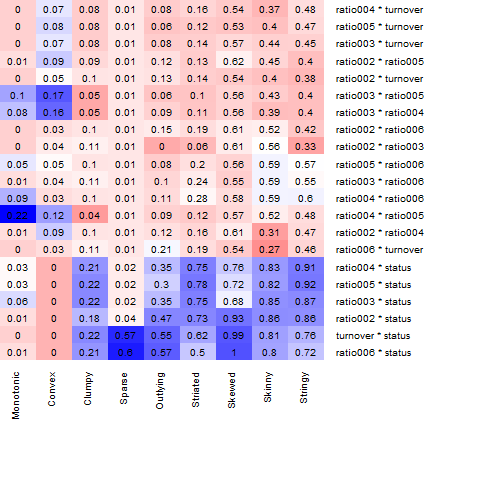
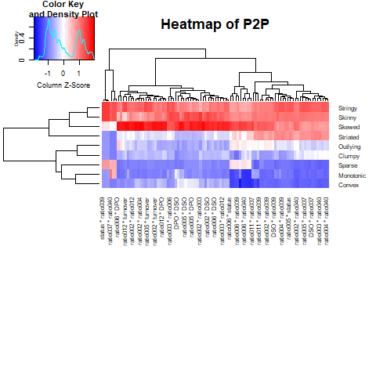
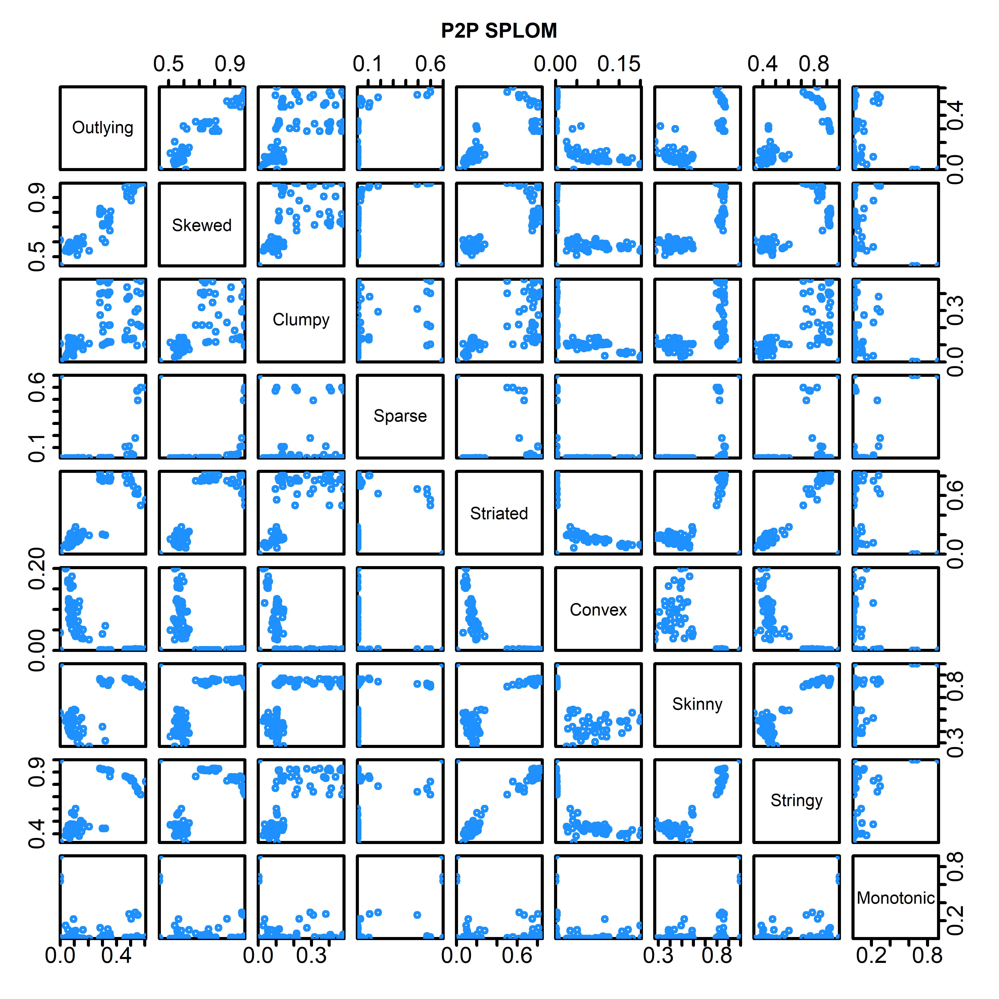
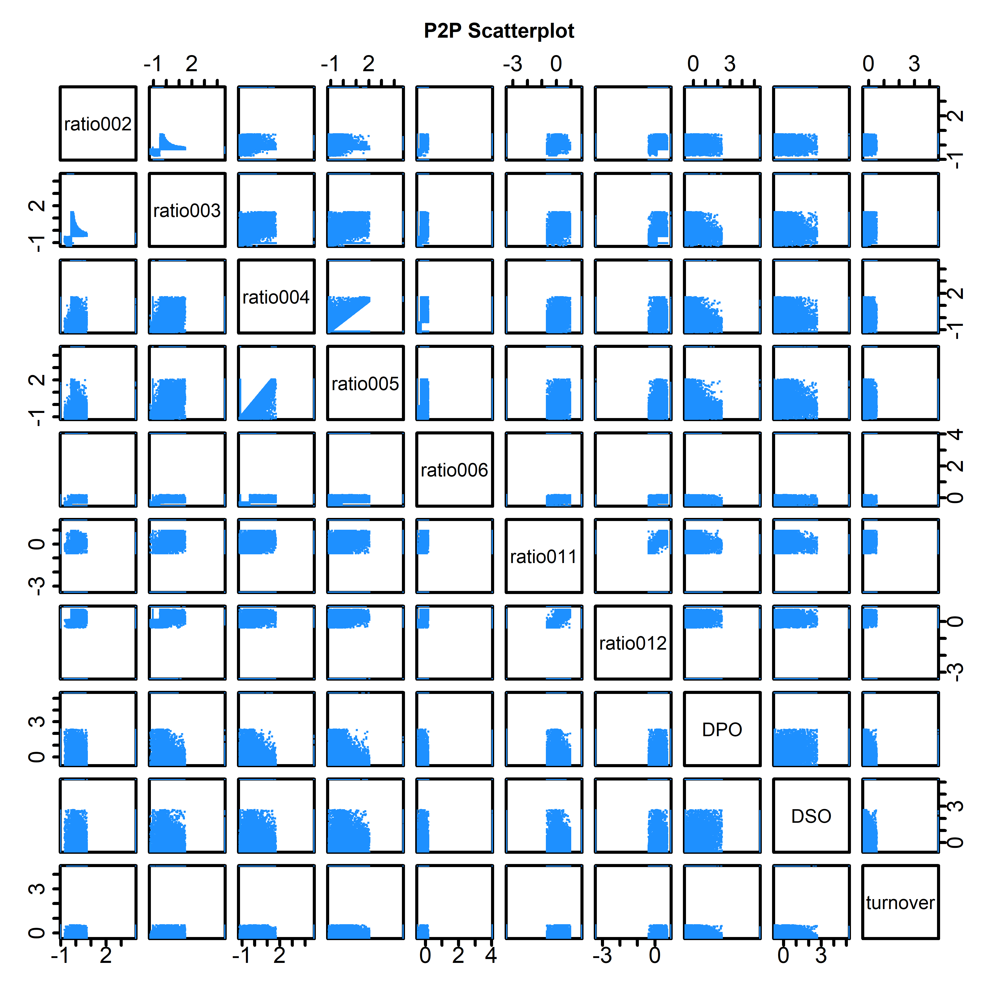
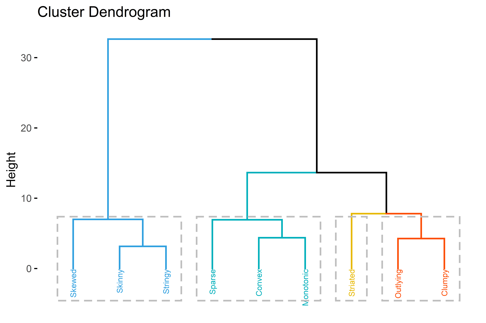
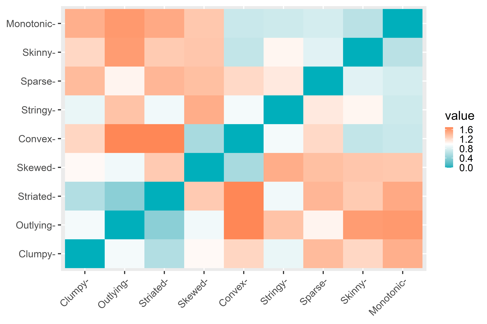

[](http://quantlet.de/)

## [](http://quantlet.de/) **SL_20200414_P2P** [](http://quantlet.de/)

```yaml


Name of Quantlet: SL_20200414_P2P

Published in: SL_Klagenfurt_2020

Description: "Calculates the scagnostic measures for the dataset p2p"

Keywords: 'scagnostics, scagnostic coefficients, SPLOM, heat-map, dendrogram, distancematrix'

Author: Alina Kohlmayer and Michaela Kordasch

Submitted:  Tue, April 14 2020 by Alina Kohlmayer

Datafile: p2p.csv

```














### R Code
```r

#A real Scagnostics application
#Authors: Alina Kohlmayer & Michaela Kordasch

# Packages needed -----------------------------------------------------------

install.packages("rJava")
install.packages("lattice")
install.packages("alphahull")
install.packages("scagnostics")
install.packages("tripack")
install.packages("RTriangle")
install.packages("igraph")
install.packages("psych")
install.packages("gplots")
install.packages("RColorBrewer")
install.packages("factoextra")
install.packages("cluster")
install.packages("magrittr")


# Libraries -----------------------------------------------------------------

library(rJava)
library(lattice)
library(alphahull)
library(scagnostics)
library(tripack)
library(RTriangle)
library(igraph)
library(psych)
library(gplots)
library(RColorBrewer)
library(cluster)
library(factoextra)
library(magrittr)


# Data ------------------------------------------------------------------------------

#change the path to your own
df.input <- read.csv("C:/Users/User/Documents/UNI_Klagenfurt/MA_8Semester/Statistical Learning/SL_Klagenfurt_2020-master/SL_20200414_P2P/p2p.csv",sep=",",dec=".",header=TRUE,na.strings="")
df.input$X <- NULL
str(df.input)

df.data <- df.input[,c('ratio002', 'ratio003', 'ratio004', 'ratio005', 'ratio006', 'ratio011', 'ratio012', 'DPO', 'DSO', 'turnover', 'status', 'ratio037', 'ratio039', 'ratio040')]
df.data_heatmap2 <- df.input[,c('ratio002', 'ratio003', 'ratio004', 'ratio005', 'ratio006', 'turnover', 'status')]


# Scatterplot ------------------------------------------------------------------------

df.data_scatter <- df.data[,c('ratio002', 'ratio003', 'ratio004', 'ratio005', 'ratio006', 'ratio011', 'ratio012', 'DPO', 'DSO', 'turnover')]

png(filename = 'Scatterplot_p2p.png', width = 3.25, height = 3.25, units = "in", res = 1200, pointsize = 4)
par(bg = NA, mar = c(5, 5, 2, 2), xaxs = "i", yaxs = "i", cex.axis = 2, cex.lab = 2 )
pairs(df.data_scatter, pch = ".", col = "dodgerblue", main = "P2P Scatterplot")
dev.off()


# Characteristic shape values --------------------------------------------------------

s <- scagnostics(df.data)
s1 <- scagnostics(df.data_heatmap2)

m.s <- t(as.matrix(s))
write.csv(m.s, file = paste0("20200414_Scagnostics_p2p.csv"))

m.s1 <- round(t(as.matrix(s1)),2)


# Plotting the SPLOM  ----------------------------------------------------------------

png("SPLOM_p2p.png", width = 3.25, height = 3.25, units = "in", res = 1200, pointsize = 4)
par(bg = NA, mar = c(5, 5, 2, 2), xaxs = "i", yaxs = "i", cex.axis = 2, cex.lab = 2)
pairs(m.s, col = "dodgerblue", main = "P2P SPLOM")
dev.off()


png("Heatmap_p2p.png")
heatmap.2(s, scale="column", main="Heatmap of P2P", col = bluered(100), density="density", #dendrogram = "none",
          notecol="black", margins=c(20,5), cexRow=0.8, cexCol=0.8, trace = "none")
dev.off()


mypal = colorRampPalette(c("red", "white", "blue"))(n = 300)
png(filename = 'Heatmap2_p2p.png')
par(bg = NA, mar = c(10, 10, 10, 10), cex.axis = 2, cex.lab = 2)
heatmap.2(m.s1, col = mypal, cellnote = m.s1, scale = "column", density.inf = "none", dendrogram = "none", notecol = "black",
          cexRow = 1, cexCol = 1, margins=c(10,13), trace = "none", keysize = 0, main="Heatmap of P2P")
dev.off()


# plots of columns vs status --------------------------------------------------------------

png(filename = 'variables vs status.png', width = 8, height = 4, units = "in", res = 1200, pointsize = 5)
par(bg = NA, cex.axis = 2)
par(mfrow = c(2,5))
plot(df.data$ratio002, df.data$status, pch = 1, main = "ratio002 vs status", col = "dodgerblue", xlab = " ", ylab = " ")

par(bg = NA, cex.axis = 2)
plot(df.data$ratio003, df.data$status, pch = 1, main = "ratio003 vs status", col = "dodgerblue", xlab = " ", ylab = " ")

par(bg = NA, cex.axis = 2)
plot(df.data$ratio004, df.data$status, pch = 1, main = "ratio004 vs status", col = "dodgerblue", xlab = " ", ylab = " ")

par(bg = NA, cex.axis = 2)
plot(df.data$ratio005, df.data$status, pch = 1, main = "ratio005 vs status", col = "dodgerblue", xlab = " ", ylab = " ")

par(bg = NA, cex.axis = 2)
plot(df.data$ratio006, df.data$status, pch = 1, main = "ratio006 vs status", col = "dodgerblue", xlab = " ", ylab = " ")

par(bg = NA, cex.axis = 2)
plot(df.data$ratio011, df.data$status, pch = 1, main = "ratio011 vs status", col = "dodgerblue", xlab = " ", ylab = " ")

par(bg = NA, cex.axis = 2)
plot(df.data$ratio012, df.data$status, pch = 1, main = "ratio012 vs status", col = "dodgerblue", xlab = " ", ylab = " ")

par(bg = NA, cex.axis  = 2)
plot(df.data$DPO, df.data$status, pch = 1, main = "DPO vs status", col = "dodgerblue", xlab = " ", ylab = " ")

par(bg = NA, cex.axis  = 2)
plot(df.data$DSO, df.data$status, pch = 1, main = "DSO vs status", col = "dodgerblue", xlab = " ", ylab = " ")

par(bg = NA, cex.axis  = 2)
plot(df.data$turnover, df.data$status, pch = 1, main = "turnover vs status", col = "dodgerblue", xlab = " ", ylab = " ")
dev.off()


# Clustering -----------------------------------------------------------------------

png(filename = 'distancematrix.png', width = 6, height = 4, units = "in", res = 1200, pointsize = 5)
res.dist <- get_dist(s, stand = TRUE, method = "pearson")
  #for computing a distance matrix between the rows of a data matrix. 
  #Compared to the standard dist() function, it supports correlation-based distance measures including "pearson", "kendall" and "spearman" methods.
fviz_dist(res.dist, gradient = list(low = "#00AFBB", mid = "white", high = "#FC4E07"))
#low = turquoise, high = orange
dev.off()


#hierarchical clustering
res.hc <- s %>%
          scale() %>%                    # Scale the data
          dist(method = "euclidean") %>% # Compute dissimilarity matrix
          hclust(method = "ward.D2")     # Compute hierachical clustering

png(filename = 'dendrogram.png', width = 6, height = 4, units = "in", res = 1200, pointsize = 5)
fviz_dend(res.hc, k = 4, # Cut in four groups
          cex = 0.5, # label size
          k_colors = c("#2E9FDF", "#00AFBB", "#E7B800", "#FC4E07"),
          color_labels_by_k = TRUE, # color labels by groups
          rect = TRUE # Add rectangle around groups
)
dev.off()


```

automatically created on 2020-04-13